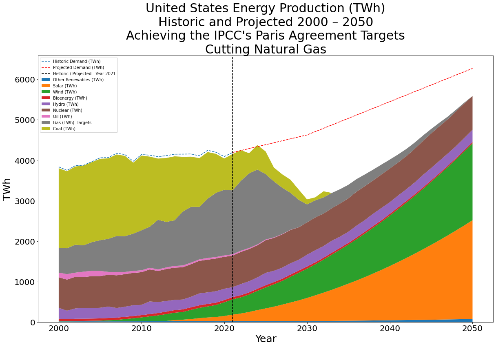

# Achieving the Paris Agreement Goals: Projecting Energy Production Sources in the United States With Time Series Modeling
 
# Overview
The United States needs to achieve Paris Agreement greenhouse gas reduction goals in the energy production sector by 2050. The nation must understand current trends in the sector to see if EPA intervention is required to meet the targets. This project projects current energy production trends in the United States and recommends changes to achieve the Paris Agreement reduction goals.

# Business Understanding

## Background: 
On December 12, 2015, the historic [Paris Agreement](https://apnews.com/article/climate-climate-change-john-kerry-paris-archive-81dabae32cb8463b86bd85d762da9e6d) legally bound the United States and other nations of the world to limit global warming to well below 2 °C (3.6 °F) over preindustrial levels. 

The Paris Agreement also commissioned the Intergovernmental Panl no Climate Change ([IPCC](https://www.ipcc.ch/)) to review the effects of climate change at 1.5 °C (2.7 °F). [The IPCC released its report on the matter in 2018](https://www.ipcc.ch/sr15/chapter/spm/), detailing the pestilence of a warmer world. 

To limit climate change to no greater than 1.5 °C over pre-industrial levels, the IPCC's 2018 special report concluded that greenhouse gas (GHG) emissions must ["decline by about 45% from 2010 levels by 2030 (40–60% interquartile range), reaching net zero around 2050."](https://www.ipcc.ch/sr15/chapter/spm/#article-spm-c) Today, in 2023, we are [already at 1.1 °C (2 °F)](https://earthobservatory.nasa.gov/world-of-change/global-temperatures). With GHG emissions as they are, scientists anticipate this average to grow by about 0.2 °C per decade unless GHG emissions are cut.

## Buisness Problem: 

The United States needs to ensure our energy production sector achieves the Paris Agreement goals. 

GHG emissions occur in multiple sectors of the economy. Electricity generation releases [about 25% of GHG emissions in the United States](https://www.epa.gov/ghgemissions/sources-greenhouse-gas-emissions), [and about 40% globally](https://www.iea.org/data-and-statistics/charts/global-energy-related-co2-emissions-by-sector). The EPA commissioned Greg Osborne to project current energy production trends and recommend policies to help the United States reach the GHG reduction targets set by the IPCC. 

Electricity generation refers to power plants creating electricity to distribute across power lines to residential and business locations. Electricity sources include fossil fuel methods, burning coal, oil and natural gas which emit GHG, and sources that do not emit GHG, nuclear, wind turbines, solar panels and hydroelectrical. Reducing America's GHG emissions and exporting that technology to our allies will result in greater reduction of GHG emissions than any other sector.

## Time-Series Modeling

The time series analysis requires projecting two factors into the future:

   **1. Construction/Reduction Rate of GHG-Emitting Power Generation**

Unfortunately, not only are fossil fuels still powering our lifestyles, but power companies in the US still [plan to open natural gas power plants in future](https://www.eia.gov/todayinenergy/detail.php?id=50436). Construction of new coal plants has [stalled in the United States](https://www.scientificamerican.com/article/will-the-u-s-ever-build-another-big-coal-plant/), but worldwide, several coal-fired power plants are scheduled to be [built in the future](https://www.reuters.com/business/energy/cop26-aims-banish-coal-asia-is-building-hundreds-power-plants-burn-it-2021-10-29/). The time series analysis must consider the growth and reduction of fossil-fuel power plants.

   **2. Construction Rate of Clean Power Generation**

Contrary to what the crisis needs, we cannot build a billion wind turbines overnight. We can only build clean energy sources as materials, labor availability, construction time, and politics allow. Fortunately, construction of new renewable and nuclear power production is underway. The time series analysis will model current trends of construction to see if they can meet the The United State's electricity needs as fossil fuels diminish.

I will then compare this time series analysis with two other factors that are not projected with a time series model:

   **1. Increase in Electricity Demand**

America's demand for electricity will rise as we cut emissions across all sectors. The poster-child example of this is the impending fuel source change for automobiles. Car manufacturers representing a quarter of global sales have pledged to [cease production of internal-combustion-engine cars](https://www.caranddriver.com/news/a38213848/automakers-pledge-end-gas-sales-2040/) within the IPCC's timeline. The most likely power source for their new cars is electricity, creating greater demand. The data used to estimate the increase in Electricity demand is provided by the International Energy Agency.

   **2. The Paris Agreement GHG Emissions reduction targets**

As part of the Paris Agreement, the IPCC has determined that GHG emissions must ["decline by about 45% from 2010 levels by 2030 (40–60% interquartile range), reaching net zero around 2050"](https://www.ipcc.ch/sr15/chapter/spm/#article-spm-c). To simulate this in the electricity production industry, I have defined this reduction as an overall reduction in electricity power generation for each fossil fuel energy production source (coal, oil and natural gas). These reduction targets are visible in the graphs produced in this report.

With all these factors, time-series modeling can assist with projection needs. This project will show the United State's energy production trends, and make recommendations for how to achieve the Paris Agreement Goals.

Compared with the random walk baseline model, the selected models achieved its goal of realistically projecting construction / reduction trends in the electricity generation sector.

## Methodology

The planned steps I will follow for this project include: 

   1. Create a time series models that project energy production trends for each fuel source in the United States to the year 2050. 
   2. Plot all energy production trends against the projected energy demands of the United States.
   3. Using interpolation, determine what reductions and construction increases are necessary to achieve the Paris Agreement goals. This will not use time series, as it's a determination of what trends must accomplish, rather than where the trends will go if left unchecked.

# Data Sources
* Energy Production Wattage by Country by Source: [Our World In Data](https://ourworldindata.org/grapher/electricity-prod-source-stacked)
    * Original source: [BP](https://www.bp.com/en/global/corporate/energy-economics/statistical-review-of-world-energy.html)
        * Historic Electricity Demand by Country: [Our World In Data](https://ourworldindata.org/grapher/electricity-demand?country=USA~GBR~FRA~DEU~IND~BRA)
        * Original source: [BP](https://www.bp.com/en/global/corporate/energy-economics/statistical-review-of-world-energy.html)
    * Energy demand projection up until 2050: [IEA](https://www.iea.org/data-and-statistics/data-product/world-energy-outlook-2022-free-dataset)
        * Data sourced from the IEA's World Energy Outlook 2022 Report: [Countries by Region](https://iea.blob.core.windows.net/assets/830fe099-5530-48f2-a7c1-11f35d510983/WorldEnergyOutlook2022.pdf#page=499)

# Visualizations
  Seven visualizations that are also in the notebooks.
    
    
    
    
    
    
    
    
    
    
    
    
    
    
    
    
    
        
        
    
    

# Conclusion
## Limitations of Scope / Provided Data

This analysis is limited to just the United States, and also doesn't clarify how the reduction in natural gas production will affect the earth's temperature at all. I have data available that will allow me to:

1. **Add All Nations:** Project the energy generation of other nations of the world, and perform a similar analysis for how they can reduce their reliance on fossil fuels.


2. **Estimate Proposed GHG Emissions Reductions:** Convert the power generation sources into estimates on GHG emissions. I have equations available that can accomplish this.


3. **Combine This Analysis With the SSP Scenarios:** Compare how reductions across the world will reduce projected GHG emissions through the different Shared Socioeconomic Pathway (SSP) scenarios proposed by the IPCC. The SSPs are used to measure what global temperatures will be like under different circumstances. I have emissions data available for each. I can subtract my emission reductions from each to see how that will effect the overall picture of each SSP.


4. **Correlate Emissions with Atmospheric Concentration:** Create time series analysis that correlate CO2 and CH4 emissions into the atmospheric concentration of both substances. The emissions data will be from the SSP scenarios as specified above. If I can correlate that with atmospheric concentration, then I can...


5. **Determine Radiative Forcings:** Convert the CO2 and CH4 atmospheric concentrations into radiative forcing with a calculation provided by NOAA and the IPCC. Radiative forcings are the common unit that allows scientists to analyze different chemical's heat absorption from the sun, which has lead to this global crisis.


6. **Global Annual Average Temperature** Convert the radiative forcing into estimated average annual temperature change.

In short, these steps will allow me to measure how the change in electricity production fuel sources will correlate with the change in average annual temperature for the world. This is my dream scope for this project. I've gathered all the data already. The only missing factor is time. 

## Future Research Opportunities

* **Enact the Dream Scope:** I would like to analyze all the countries and regions of the world in the same way I did the United States. I would like to connect the dots to draw a direct correlation between power generation sources and the average annual global temperature.


* **Add 2022's Data:** I would also like to add 2022's electricity generation data so I don't have to begin projecting after 2021.


* **Better Emissions Data:** Though I didn't use it for this analysis, as part of the dream scope, I found emissions data on all countries, but it had one frustrating omission. I couldn't find emissions data exclusively for the power generation sector. The data I could find on this issue combined emissions from power generation with emissions from all fuel combustion, including automobiles. I would like to further research this so I could better learn the scope of emissions for the power generation sector.


* **Primary Power:** This analysis focused exclusively on Secondary Power, which is making the fuel at the power plant. It doesn't acknowledge emissions from extracting natural gas, oil and coal from the earth. We know that a lot of carbon emissions occurs before the primary fuel source enters the power plant ready to be burned. It would be interesting to see how much reducing reliance on these fuel sources decreases emissions at their extraction.


* **Transmission Losses:** Energy is loss between power plants and the businesses and homes they service just through the transmission across the power lines. It would be interesting to add these considerations to the study.


* **Atmospheric Concentration of Methane (CH4):** Before I limited my scope to America and power generation reduction to meet IPCC targets, I experimented with building a time series model to correlate GHG emissions with atmospheric concentration. I successfully modeled the atmospheric concentrations with CO2 emissions, but I could not correlate Methane emissions with atmospheric concentration. This will take more research. (To view this work, look at the Multivariate Jupyter Notebook found in the same directory as this notebook.)

## Recommendations

This analysis yields to three recommendations:

1. **Reduce Natural Gas:** We are fortunate that market forces are driving coal and oil power production out of existence. The same is not true for natural gas. It is already the primary source of electricity generation in America. We must actively prepare for its replacement as soon as possible.


2. **Double Production of Wind and Solar Power:** This is critical. To meet the future challenges of reducing our GHG emissions in the power generation sector, we must replace it with renewable energy that does not emit GHG at all. At this time, the United States is not producing enough new wind turbines and solar panels to account for the reductions we need. We must double capacity, the double capacity, then double capacity a third time for the next three years. Then we will have the production capacity to eliminate natural gas power generation.


3. **Export Wind and Solar:** If we ramp up our solar and wind capabilities to meet the challenge we face, there will be no reason to cease operating at this capacity. Sell the excess solar panels and wind turbines to other nations. This will be good business for the United States, and it will help meet the challenges we face with the climate crisis. Acting alone will not be enough to preserve the world we live in today. We must do everything we can to encourage other nations to switch to renewable energy sources as soon as possible.


Here are three more recommendations that are not detailed by this analysis, but are related to the problem:
1. **Invest in Nuclear ASAP:** I did not consider new nuclear power plants as a replacement for natural gas for two reasons: 1) Nuclear is the most expensive fuel source at this time and 2) Nuclear plants take about a decade to build. 

    However, there are multiple companies rapidly trying to change this, or as rapidly as they can. [TerraPower](https://www.terrapower.com/), owned by Bill Gates, is currently building a power plant in Wyoming, but it doesn't open until 2030. Even then, the amount of electricity it will provide is not enough to significantly replace natural gas. It is a test project to see if Nuclear Power can be done safer and cheaper. If it works, it theoretically could be mass produced across the country, and the world, but... now we're talking about 2040 at the earliest. We need solutions between now and then. Those solutions are the use of wind and solar. It's the best we've got at this time.
    

2. **Invest in Educating the Public:** Years ago, the United States forced cigarette manufacturers to spend as much money on raising awareness of the ill effects of smoking as they did on advertising. It was very effective. Americans do not smoke as much as many other countries. Why not do the same thing with the dangers of fossil fuels? Part of the reason the climate crisis has been so difficult to manage politically is the public is barely aware of the dangers or the exact causes. Help the public understand the effects of emissions, including the eight million people who die every year of pollution born diseases.


3. **Buy Natural Gas Power Companies:** American capitalists will fight he reduction in natural gas as hard as they possibly can because it is their paycheck. Instead of the government playing the role of regulator and legislating natural gas out of existence, take a page from the time-honored tradition of buying them out. Answer the cries of communism with a promise to sell the companies back to some willing capitalist a specified number of years after their emissions have dropped to zero.

# Repository Structure

```
  ├── Visualizations : Images used in PPT and readme
  ├── Data : Files downloaded to produce this project
    ├── Export : Cleaned files exported from the Jupyter Notebook
    ├── LevelUp : Unused data saved for future opportunity
├──Capstone_Proposal.pdf : Proposal for this project.
├──GitHub.pdf : PDF of this repository
├──Notebook.pdf : PDF print of the main Jupyter Notebook used for modeling 
├──Notebook_EDA_and_Data_Cleaning.pdf : PDF print of data cleaning notebook
├──Presentation.pdf : Presentation for the EPA
├──README.md : Project information and repository structure
├──judge-1377884607_tweet_product_company.csv : The raw data analyzed
├──data_import_cleaning_export.ipynb : Jupyter Notebook EDA and cleaning
└──Student.ipynb : Jupyter Notebook used as project write up and modeling

```
